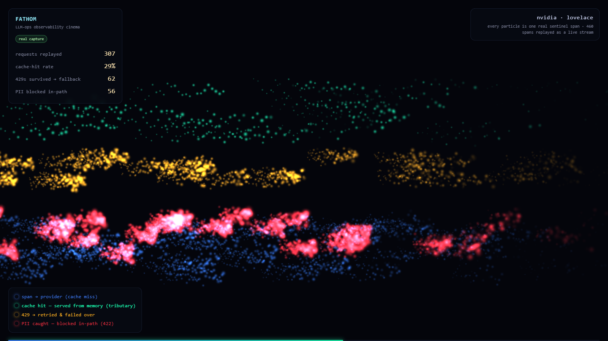

# Fathom — spike

**A WebGPU "observability cinema" for LLM-ops telemetry — feasibility spike + real-data proof.**

Every particle is one real LLM-gateway span. Requests flow as glowing comets into lanes by their
real outcome: **cache hits** stream off as a cyan tributary, **429s** retry and fail over in amber,
**PII** is caught and blocked in-path as red flares, and plain **spans/misses** run as the blue river.



> Perf and the real-data look are proven (see [`PROOF.md`](./PROOF.md)); the v1 build is underway per
> [`SPEC.md`](./SPEC.md). **Done: M0** (the app) **+ M1** (a generic OTLP live server — real sentinel spans
> stream in as comets). **Next:** drill-down (flare → the real span), 3D cost flame graph, bloom, hosted demo.

---

## Components

### 1. Cinema — the app (`app/`)
A **Vite + React + TypeScript** app: a thin React shell (HUD / legend / controls) over a **raw-WebGPU core**
(`app/src/gpu/`) that renders spans as glowing comets in 4 outcome lanes. Two modes: **live** (SSE, one comet
per span as it arrives) and **replay** (loops a captured trace). The primary artifact + seed of Fathom v1.

```bash
npm run app:install  # once — installs app/ deps (vite, react, typescript)
npm run dev          # http://localhost:5173  (?source=live|real|sample)
npm run build        # tsc -b + vite build -> app/dist
node app/shot.mjs    # build first; screenshots the running app on the real GPU
```

### 2. Live server — `server/` (M1)
Node + TypeScript: a **generic OTLP/HTTP receiver** (`POST /v1/traces`) → normalized mapper → ring buffer →
**SSE `/stream`**. Any OTel gateway feeds it; sentinel via `OTEL_EXPORTER_OTLP_ENDPOINT`. Optional sentinel
`/traces?since=` poller (judge scores) + file replay for the demo.

```bash
npm run server:install
npm run server                            # OTLP POST /v1/traces · SSE /stream  (:4319)
npm --prefix server run e2e               # in-process OTLP→map→SSE proof (real spans)
node server/tools/sentinel-otlp-check.mjs # REAL sentinel gateway → OTLP → Fathom (offline, no keys)
```

### 3. Perf spike (`spike/`)
A compute-shader particle simulation (per-particle flow, cache-hit fork, PII flares) + additive render,
with a `timestamp-query` benchmark that measures **true GPU-time per frame** across 100k→2M particles.

```bash
npm install          # installs playwright-core (uses your system Chrome, no browser download)
npm run bench        # drives the real GPU, prints a table + GO/LOD/RETHINK verdict, writes spike/river-1M.png
npm run serve:spike  # or open http://localhost:8971/  to poke it interactively
```

**Verdict: GO** — 1M particles at **0.60 ms GPU/frame** on an RTX 4070 (~28× under the 16.7 ms/60fps
budget), and **3.47 ms** on *integrated* Intel UHD (4.8× headroom). Full numbers in [`PROOF.md`](./PROOF.md).

---

## The data pipeline (real spans, offline, no keys)

```
sentinel gateway  --pnpm load (mock upstreams)-->  raw TraceRecord[]  --ingest.mjs-->  traces.json  --app (WebGPU)-->  river
   (real code)         no API keys, no network         (data/*.json)     (normalize)     (normalized)    (app/src/gpu)
```

`ingest.mjs` is the **only** sentinel-aware code — it maps sentinel's `TraceRecord` to a small normalized
schema. The renderer knows nothing about sentinel, so **any** source that can produce that schema works.
Full schema + capture steps are in [`ARCHITECTURE.md`](./ARCHITECTURE.md).

The shipped `traces.json` is **460 real `sentinel` spans** captured offline (140 cache hits · 95
fallbacks · 85 PII blocks). `traces.sample.json` is a clearly-labeled *synthetic* sample used only to
develop the renderer.

---

## File map
| Path | Role |
|---|---|
| `app/` | **cinema** — Vite + React + TS (raw-WebGPU core in `app/src/gpu/`, SSE client `app/src/lib/`, shell `app/src/ui/`) |
| `server/` | **live server** — OTLP receiver + SSE + poller/replay (`src/`), proofs in `tools/` + `e2e.ts` |
| `shared/schema.ts` | normalized ingestion contract (imported by `app/` and `server/`) |
| `spike/` | perf spike + benchmark (`index.html`, `main.js`, `bench.mjs`) |
| `ingest.mjs` | sentinel `TraceRecord[]` → normalized schema (the ingestion contract) |
| `synth-traces.mjs` | synthetic sample generator (dev only) |
| `record.mjs` | Playwright capture → `.png` + `.webm` (+ `.mp4`/`.gif` with ffmpeg) |
| `tools/sentinel-dump.ts` | reference capture script (copy into `<sentinel>/load/`, run, delete) |
| `fathom.html` · `fathom.js` | legacy standalone cinema (superseded by `app/`) |
| `traces.json` · `data/` | current normalized trace · captured raw records |
| `CLAUDE.md` · `ARCHITECTURE.md` · `PROOF.md` · `SPEC.md` | agent guide · design · measured evidence · **v1 build spec** |

## Honest caveats
- The cinema is driven by **real spans**, but they're **replayed** (not live) and **interleaved** into a
  mixed stream — the load harness emits them in scenario phases, which isn't real arrival timing. Spans and
  proportions are unchanged; only replay position is shuffled. The panel says "replayed as a live stream."
- Model names show as `std`/`pii` — the literal routed-model ids in sentinel's load config, not prettied.
- ffmpeg isn't required; without it you get `.webm` (plays everywhere). With it, `record.mjs` also emits `.mp4` + `.gif`.

## Requirements
node ≥ 20 · python 3 (for `npm run serve`) · a WebGPU-capable Chrome/Edge. See [`CLAUDE.md`](./CLAUDE.md).
